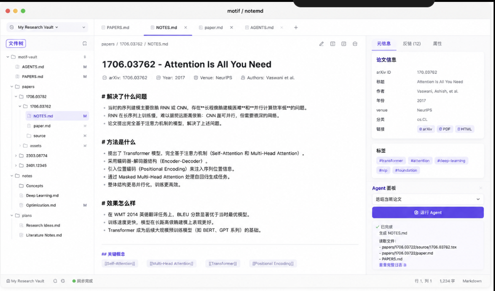
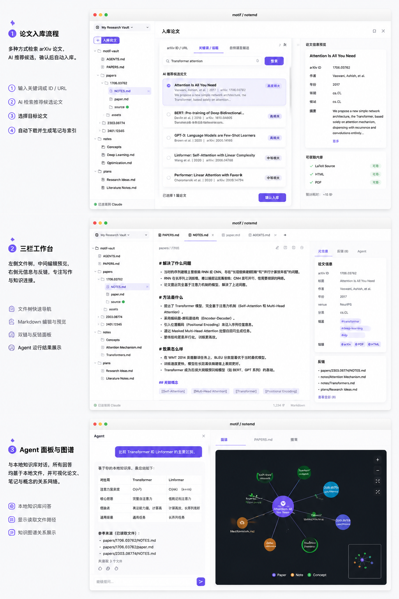

# Motif

<p align="center">
  <strong>Agent-first local research library</strong><br />
  Markdown vault · wikilinks · arXiv papers · ACP agents — owned by you, not locked in a proprietary database.
</p>

<p align="center">
  <a href="https://github.com/poco-ai/motif/stargazers"></a>
  <a href="https://github.com/poco-ai/motif/network/members"></a>
  <a href="https://github.com/poco-ai/motif/issues"></a>
  <a href="https://github.com/poco-ai/motif/pulls"></a>
  <a href="LICENSE"></a>
  <a href="https://github.com/poco-ai/motif/releases"></a>
</p>

<p align="center">
  
  
  
  
  
</p>

---

## Why Motif?

Classic reference managers are great at **storing** PDFs. Agent workflows need something else:

- Reading highlights and notes locked in single files are hard for agents to reuse across papers.
- Every chat restarts without a stable local knowledge map.
- PDFs are human-friendly but noisy for models; structure and links should be addressable.

**Motif** is a local, file-first research workspace for both humans and agents. Papers, notes, and indexes live as Markdown (and source files) in a vault you control. Agents connect via **BYOA** (bring your own ACP agent) — Motif is the client, not a locked-in model host.

## Features

- **Local vault** — open a folder; all core data is plain files you can edit, sync, or version.
- **Markdown workbench** — multi-pane layout: file tree, source/PDF/HTML, preview/notes, right sidebar.
- **Wikilinks & backlinks** — `[[links]]` across notes and papers (Obsidian-style).
- **Agent sidebar** — chat with your vault via ACP backends (Claude, Codex, Grok Build, …).
- **Paper-centric layout** — remote PDF/HTML from metadata; NOTES beside the paper.
- **Desktop-native** — Tauri 2 on macOS (overlay title bar, menus, shortcuts).

> Status: early MVP. See [docs/ROADMAP.md](docs/ROADMAP.md) and [docs/PRD.md](docs/PRD.md).

## Screenshots

<p align="center">
  
</p>

<p align="center">
  
</p>

## Quick start

### Prerequisites

- [Node.js](https://nodejs.org/) 20+
- [pnpm](https://pnpm.io/) 9+
- [Rust](https://rustup.rs/) (stable)
- Platform deps for [Tauri 2](https://v2.tauri.app/start/prerequisites/)

### Install & run

```bash
git clone https://github.com/poco-ai/motif.git
cd motif
pnpm install

# Desktop app (recommended)
pnpm tauri dev

# Frontend only (no native vault / agent backends)
pnpm dev
```

### Scripts

| Command | Description |
| --- | --- |
| `pnpm tauri dev` | Dev desktop app |
| `pnpm build` | Build frontend |
| `pnpm tauri build` | Production desktop bundle |
| `pnpm lint` | TypeScript (Biome) + Rust (clippy) |
| `pnpm format` | Format TS + Rust |

## Project structure

```text
motif/
├── src/                 # React + TypeScript UI
├── src-tauri/           # Tauri 2 + Rust (vault, wiki, ACP)
├── docs/                # PRD, tech, UI, roadmap
└── package.json
```

## Documentation

| Doc | Topic |
| --- | --- |
| [docs/PRD.md](docs/PRD.md) | Product requirements |
| [docs/TECH.md](docs/TECH.md) | Technical design |
| [docs/UI.md](docs/UI.md) | UI conventions |
| [docs/DATA_MODEL.md](docs/DATA_MODEL.md) | Vault layout & files |
| [docs/WIKILINKS.md](docs/WIKILINKS.md) | Wikilink / backlink design |
| [docs/ROADMAP.md](docs/ROADMAP.md) | Version roadmap |
| [docs/COMPONENTS.md](docs/COMPONENTS.md) | UI component conventions |
| [docs/API.md](docs/API.md) | Commands / APIs |

## Stack

- **Shell:** [Tauri 2](https://v2.tauri.app/)
- **UI:** React 19, TypeScript, Tailwind CSS 4, shadcn/ui, AI Elements
- **Editor:** Plate / Markdown
- **Agents:** Agent Client Protocol (ACP), BYOA

## Contributing

Issues and PRs are welcome.

1. Fork and create a feature branch.
2. Keep changes focused; follow existing lint/format setup (`pnpm lint` / `pnpm format`).
3. Open a PR with a clear description of *what* and *why*.

For larger ideas, open an issue first so we can align on scope.

## License

This project is licensed under the [MIT License](LICENSE).

## Star History

[](https://www.star-history.com/#poco-ai/motif&Date)
