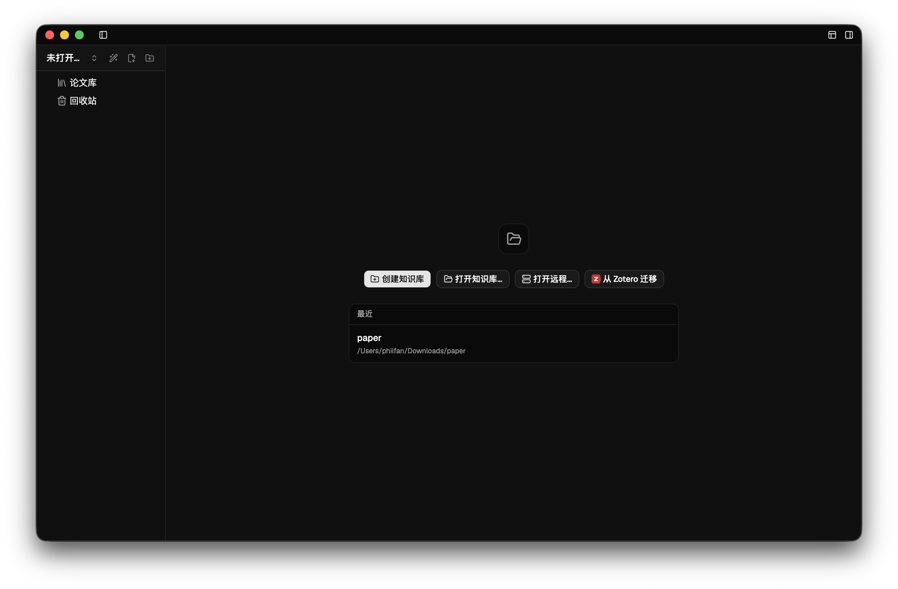
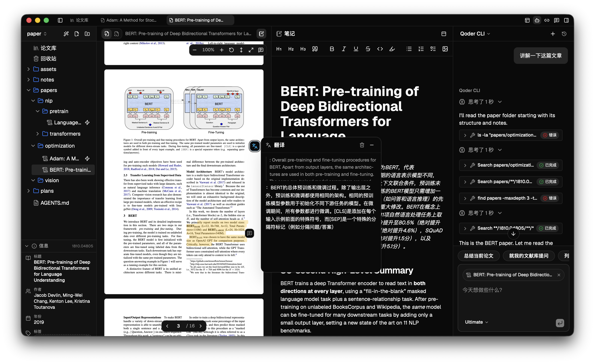
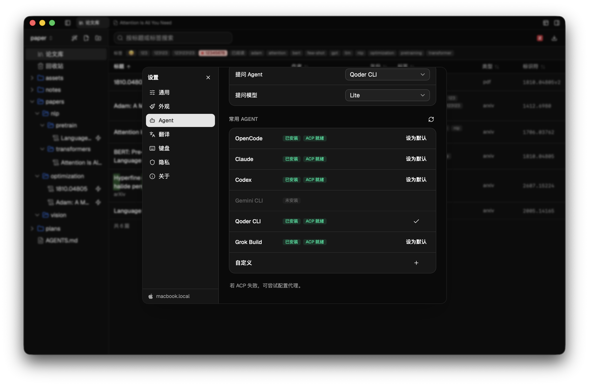
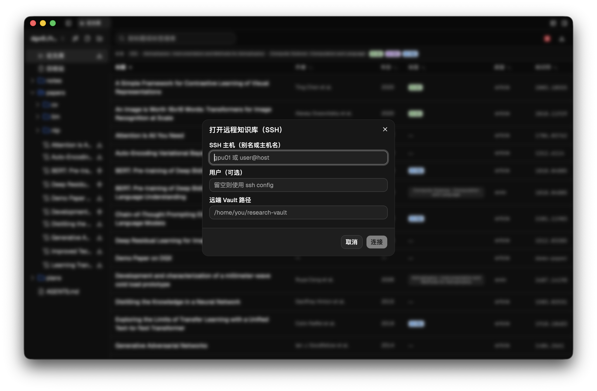
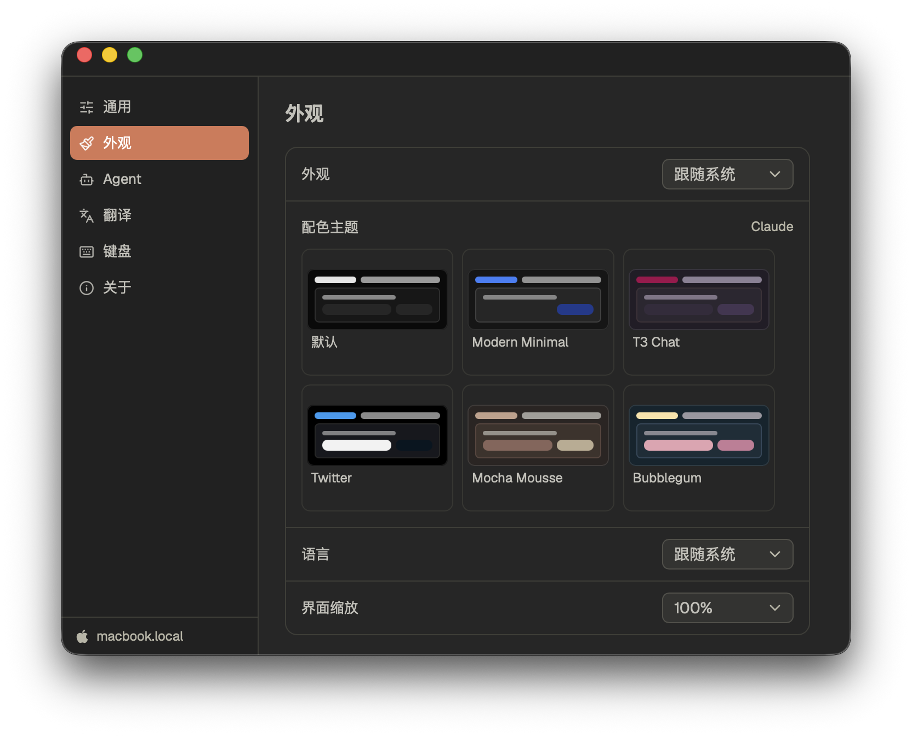

<p align="center">
  
</p>

<p align="center">
  <a href="https://github.com/poco-ai/agentero/stargazers"></a>
  <a href="https://github.com/poco-ai/agentero/network/members"></a>
  <a href="https://github.com/poco-ai/agentero/issues"></a>
  <a href="https://github.com/poco-ai/agentero/pulls"></a>
  <a href="LICENSE"></a>
  <a href="https://github.com/poco-ai/agentero/releases"></a>
  <a href="https://agentero-docs.poco-ai.com"></a>
</p>

传统文献管理器对 Agent 并不友好：

- 阅读高亮和笔记被锁在单篇文件里，Agent 很难跨论文复用。
- 每次对话都要重新提供上下文，缺少稳定的本地知识地图。
- PDF 对人友好，但对 Agent 来讲不是最舒服的阅读材料。

**Agentero** 旨在构建 Agent 友好、Agent 原生的文献管理方式，探索人与 Agent 在文献管理中的协作方式。

## 功能

- **BYOA**（Bring Your Own Agent）：通过 ACP 连接本机 Agent，Agentero 不锁定具体 Agent 或模型，工作上下文留在本地 Vault。
- **Agent 原生体验**：支持划词对话、论文导入和 Zen 模式，让 Agent 参与检索、阅读与整理工作流。支持 Skill 导入。
- **衔接 Zotero 生态**：兼容 Zotero 生态的导入方式，支持从标识符、链接或浏览器插件保存论文。一键导入 Zotero 书库，保留标签、笔记和附件。随时导出 BibTeX / BibLaTeX，衔接 LaTeX 写作流程。
- **论文翻译**：划词后并排查看原文与译文，结合论文上下文统一术语。
- **双链与知识图谱**：使用 Obsidian 风格的 `[[wikilinks]]` 连接论文、概念和笔记，浏览本地知识图谱。
- **PDF 深度阅读**：支持页码导航、适应宽/整页、大纲、⌘F 查找、平滑划词、高亮、批注、提问与翻译。
- **所见即所得的 Markdown**：支持实时预览和编辑。
- **远程文献访问**：通过 SSH 隧道浏览远程知识库，数据保留在用户自己的服务器上。
- **多系统兼容**：Mac、Windows、Linux，快捷键与常用软件保持对齐，不改变使用习惯。







## Quick Start

### 桌面应用

前往 [Agentero](https://agentero.poco-ai.com) 进行下载。

HomeBrew

```bash
brew tap poco-ai/agentero
brew install --cask agentero
```

### CLI

HomeBrew

```bash
brew tap poco-ai/agentero
brew install agentero
```

## 开发

### 项目结构

```text
agentero/
├── AGENTS.md             # 面向 Agent / 开发者的仓库指南
├── mkdocs.yml            # MkDocs 文档站配置
├── src/                  # React + TypeScript 前端
├── src-tauri/            # Tauri 2 + Rust Host（Vault、Wiki、ACP）
├── cli/                  # headless CLI（bin agentero；见 docs/backend/cli.md）
├── templates/vault/      # Create Vault 脚手架（含 .agents/skills）
├── docs/                 # MkDocs：usage / frontend / backend / development（草稿）
└── package.json
```

### 技术栈

<p align="center">
  
  
  
  
  
</p>

- **桌面壳**：[Tauri 2](https://v2.tauri.app/)
- **前端**：[React](https://react.dev/)、[TypeScript](https://www.typescriptlang.org/)、[Tailwind CSS](https://tailwindcss.com/)、[shadcn/ui](https://ui.shadcn.com/)、[AI Elements](https://elements.ai-sdk.dev/)
- **窗口管理**： Dockview
- **PDF**： Embedded PDF
- **编辑器**：[Plate](https://platejs.org/) / Markdown
- **Agent**：[Agent Client Protocol](https://agentclientprotocol.com/)、BYOA

### 测试

```bash
git clone https://github.com/poco-ai/agentero.git
cd agentero
pnpm install

# 清除前端与 Rust 构建产物
pnpm clean

# 桌面应用（推荐）
pnpm tauri dev

# 仅前端预览（无原生 Vault / Agent 后端）
pnpm dev
```

## 贡献

欢迎提交 Issue 和 PR。

1. Fork 后创建功能分支。
2. 保持改动聚焦，并遵守现有 lint/format 设置（`pnpm lint` / `pnpm format`）。
3. PR 描述清楚改动内容和原因。

较大的想法请先开 issue 对齐范围。

## License

本项目使用 [MIT License](LICENSE)。

## Star History

[](https://www.star-history.com/?type=date&repos=poco-ai%2Fagentero)

## 致谢

感谢 [LinuxDo](https://linux.do/) 和 [ModelScope](https://modelscope.cn/) 社区的支持与反馈。
