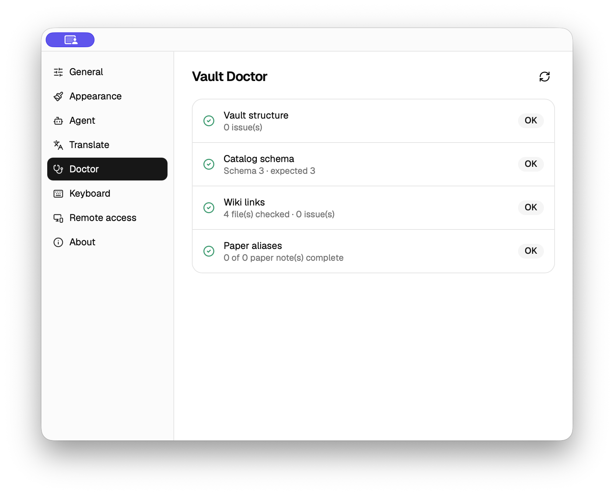

# Vault Doctor

Doctor 聚合本地 Vault 的只读完整性检查，并为 Catalog 论文笔记提供一类显式确认的安全修复。

## 检查范围

`DoctorReport` 包含四组结果：

1. Vault 目录结构（`papers/`、`notes/`、`plans/`、`.agentero/`）；
2. `.agentero/catalog.sqlite` 是否存在且 schema 与当前版本一致；
3. 与桌面导航共用 `WikiIndex::check_links` 的双链语义结果；
4. Catalog 中每篇 `papers/**/NOTES.md` 的 frontmatter aliases。

其它 Markdown 不参与论文 aliases 迁移。一次检查不会创建目录、迁移 Catalog 或修改 Markdown；Catalog 以只读 SQLite connection 打开。

一篇论文笔记至少要有两个按 Wiki resolver 规则归一化后仍不同的非空 alias。Doctor 保留现有自定义 aliases，并提出可编辑的标题 alias 与确定性短 alias：

- 优先使用冒号或破折号前的有效短标题；
- 英文标题使用去掉常见连接词后的首字母缩写；
- 中文标题无可靠短标题时使用「第一作者 + 年份」；
- 冲突时依次追加年份、第一作者；仍冲突则只报告、默认不选。

重复的正式标题只告警，不修改 Catalog；编辑标题 alias 也不会回写 Catalog 或 `metadata.json`。

## 安全修复

`doctor_apply_aliases` 只接受当前 Catalog 行对应的 `NOTES.md`。批量写入前会：

- 拒绝主窗口报告的未保存编辑路径；
- 校验诊断时的 SHA-256 内容哈希；
- 拒绝复杂、异常或无法精确定位的 YAML；
- 先规划全部文件，再**原地写入**（不改 path / 文件名，只改 frontmatter）；
- 任一写入失败时按规划内容回滚本批已写文件。

不使用 tmp+rename 式原子替换：那样会被 Vault 文件监听器当成「不完整改名」，误报外部改名未修复链接。双链以 path 为主，别名修复本来就不需要改链接。

无 frontmatter 时只前插一个 YAML 块；简单 frontmatter 缺 aliases 时在关闭 fence 前插入；简单 inline/block aliases 只替换该属性的字节范围。其它键、注释、顺序与正文不重新序列化。

## 入口

- 桌面：设置 → 知识库诊断；远程 Vault 当前显示不可用。
- CLI：`agentero doctor`、`agentero doctor fix aliases`、`agentero -y doctor fix aliases`。
- Host：`doctor_check`、`doctor_apply_aliases`、`doctor_set_dirty_paths`。

代码：`src-tauri/src/features/doctor/`、`src-tauri/src/features/wiki/frontmatter.rs`。
